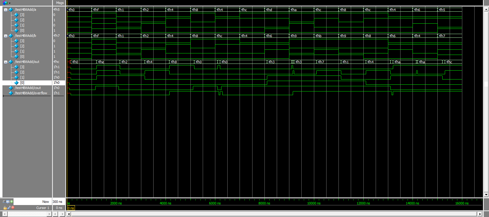

# Lab 0 Report
## 1. Waveforms


The above represents the waveform of the inputs and output of the Full Adder. We can see that there are glitches along the waveform such as at around T = 6200 ns.

In order to have accurate results, one should wait for the glitches to settle. In terms of our implementation, we expect to wait 600 ns+ (Roughly 150 ns per individual full adder bit, cascaded four times with a final XOR at the end representing 50 ns).

We get the above via noting that longest path in our full adder flowed through three gates that have an assumed 50 ns delay.
## 2. Test Case Strategy
We chose our test cases to show, most importantly, that our adder can add, without failure, the numbers that it can and should be able to handle (unsigned 4-bit integers whose sum is also a 4-bit integer).

However, we also wanted to show that our adder can gracefully handle addition of signed 4-bit integers, overflow, and carryout. For example, the addition of two negative numbers might yield a positive number, and if such, this should be marked with an overflow.

Our test bench covers a wide range of possible occurrences. We have tested edge cases (all inputs off, all inputs on), the commutative property (b0100 + b1100 = b1100 + b0100), and multiple cases of all permutations of having or not having overflow and carryout. All of our categories of testing are further explained in section 4.

The full test bench is listed below:
```
a      b      Sum     |   Carryout    Overflow | Expected sum   Expected Carryout  Expected Overflow|

                                        Edge Case Tests                                              
0000   0000   0000    |      0           0     |    0000                 0                  0       |
1111   1111   1110    |      1           0     |    1110                 1                  0       |

                                      Individual Bit Tests                                           
0001   0001   0010    |      0           0     |    0010                 0                  0       |
0010   0010   0100    |      0           0     |    0100                 0                  0       |
0100   0100   1000    |      0           1     |    1000                 0                  1       |
1000   1000   0000    |      1           1     |    0000                 1                  1       |

                                  Carryout, No Overflow Tests                                        
0100   1100   0000    |      1           0     |    0000                 1                  0       |
1100   0100   0000    |      1           0     |    0000                 1                  0       |
1101   0110   0011    |      1           0     |    0011                 1                  0       |

                                    Carryout, Overflow Tests                                         
1010   1001   0011    |      1           1     |    0011                 1                  1       |
1100   1011   0111    |      1           1     |    0111                 1                  1       |
1000   1001   0001    |      1           1     |    0001                 1                  1       |
1100   1000   0100    |      1           1     |    0100                 1                  1       |

                                 Overflow, No Carryout Tests                                         
0100   0110   1010    |      0           1     |    1010                 0                  1       |
0110   0100   1010    |      0           1     |    1010                 0                  1       |
0101   0111   1100    |      0           1     |    1100                 0                  1       |

```

## 3. Test Case Failures
After programming our board for the first time, we tried adding b0001 + b0001 and got the expected result of b0010. However, after trying this first test, we realized that we had not yet thoroughly read through either lab0_wrapper.v or the README.md and that we actually did not know what pressing each button would do or what different lights signified.

We then read through lab0_wrapper.v and the README.md and realized that we had not taken into account adding in 2's complement; we had only considered unsigned integers. We tried adding two positive numbers, b0100 + b0100, and our board failed: we got the negative b1000 with no indication that this answer was wrong. After pressing button 3, the overflow LED was not lit, even though it should have been.

This failure made us realize that we had to figure out how to handle numbers that should result in an overflow. We considered two situations: b0100 + b0100 = b1000 and b1000 + b1000 = b[1]0000. In both situations, we realized that the carryin and carryout for the 4th bit are different. In cases without overflow, the carryin and carryout are the same (for example b0001 + b0001 = b0010 has both carryin and carryout of 0, while b1111 + b1111 = b[1]1110 have both carryin and carryout of 1). Thus, we decided that we had to XOR the carryin and carryout of the fourth bit and the result would be the overflow. After we added the XOR to our design, all tests that we ran on our board passed.

## 4. Summary of Testing on board
To make sure our adder is fully functional, we devised various test cases to cover all the possible cases; the categories are as following (assume all numbers in examples are binary):

1. adding on each of the four digits
    - examples:
      - 0010 + 0100 = 0110    
      - 1001 + 0000 = 1001
2. Carryout = 1, Overflow = 0
    - examples:
      - 1111 + 1111 = 1110
      - 1100 + 0100 = 0000
3. Carryout = 0, Overflow = 1
    - examples:
      - 0100 + 0110 = 1010
      - 0111 + 0101 = 1100
4. Carryout = 1, Overflow = 1
    - examples:
      - 1010 + 1001 = 0011
      - 1100 + 1011 = 0111
5. Carryout = 0, Overflow = 0
    - examples:
      - 0001 + 1100 = 1101
      - 0110 + 0010 = 1000
6. Commutative law
    - examples:
      - 1011 + 1101 = 1000
      - 1101 + 1011 = 1000

The full list of all 16 tests that we tested on the FPGA (we ran all tests in our test bench) are listed in section 2.
### Picture of testing on FPGA:
The following pictures are the test b0100 + b1100 = b0000, overflow = b0, carryout=b1 being ran on our FPGA.
#### a = b0100

#### b = b1100

#### sum = b0000

#### overflow = b0, carryout = b1

## 5. Summary Statistics of Synthesized Design


Based on the summary statistics, we see that our implementation of the 4-Bit Full Adder used the following resources:

1. Flip Flops (FF)
  - 1%
2. Look Up Tables (LUT)
  - 1%
3. Input/Output (I/O)
  - 13%
4. Clock Buffer (BUFG)
  - 3%
5. Power On Chip
  - 7.318 W

Based on the information above, we can see that the implementation has a relatively low spatial area/utilization on the FPGA. We use roughly 1% of the FPGA's available Flip Flops and Look up tables in the implementation. The most used resource was the I/O.
