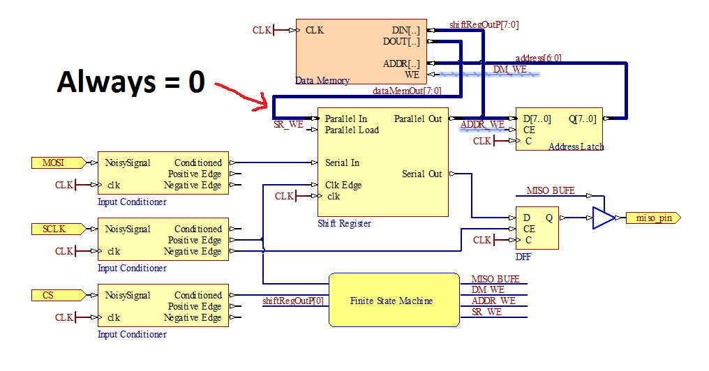

# Lab 2 report
## Input Conditioner

### Circuit Diagram

### Max length of input glitch

For a waittime of 10, the maximum length input glitch that will be suppressed is 200 units. This is because the clock is 20 time units, and the waittime is 10, so 10*20 = 200.

### Test bench strategy

A great way to test the input conditioner is to simply look at the wave form after generating waves that could test certain situations. For instance, if the input noisysignal is high for such a short amount of time that it is a glitch, the conditioned output should never go high. However, once the input noisysignal is high for long enough, the conditioned output should be high for the right amount of time. Furthermore, when conditioned has a positive edge and a negative edge, outputs positiveedge and negativeedge should be set, respectively.

In order to test these conditions in a test bench, rather than just by looking at the waveforms, we wrote a test bench that works for a given waittime (3). We set the clock to a given frequency and thus know that until the input noisysignal has been high for so long, conditioned should not be set to high. Since we know when conditioned should be set high, we know that that is when the output positiveedge should very briefly be set high. Furthermore, since we are controlling for how long noisysignal is high, we then know for how long conditioned should be set high and thus when negativeedge should be briefly set for high. If any of these test cases fail, we know that the input conditioner has failed, and we can also know what part of the input conditioner does not work.

## Shift Register

### Testing strategy

To test the shift register, we implemented two test cases to test “Serial in Parallel out” and  “Parallel in Serial out”. First we tested “Parallel in Serial out”, we set parallel load to be 1 and parallel data in to be 10011010. We verified the test by comparing the serial output and most significant bit of the input.
For “Serial in Parallel out”, we set peripheral clock edge to be 1, 0 to parallel load and serial input to be 1. We then verified the parallel output by seeing whether it’s a one bit shift of the previous test input(parallel data in).

## SPI Memory Testing

### Testing strategy

In order to test our SPI Memory, we decided to write and read from every address. This checks if everything works. If any address fails, then we know that there is a problem.

## Fault Injection

### Description

As you can see from the above image, we injected the fault that the data output of datamemory would always be 0, thus meaning that the parallel in for the shift register should always be 0. This means that no matter what address we attempt to write to, we will actually always be writing to address 0.

## Work Plan Reflection

We followed our plan well for the first half of the project. We were meeting as scheduled and we stuck to our plan up until the mid-point checkin. However, for the second half of the lab, our team had difficulty finding time for team meetings due to conflicting schedules. As a result, we didn’t continue to work on the lab until Friday (also partially due to the fact that the NINJA tutorial was on Thursday). Also, we underestimated the difficulty and time we needed for SPI memory as well fault injection, which later proved to take much more time than we had expected. For the next lab, we would allocate more time for important tasks and try to meet more frequently. We think that overall, trying to stick to a work plan is very useful.
