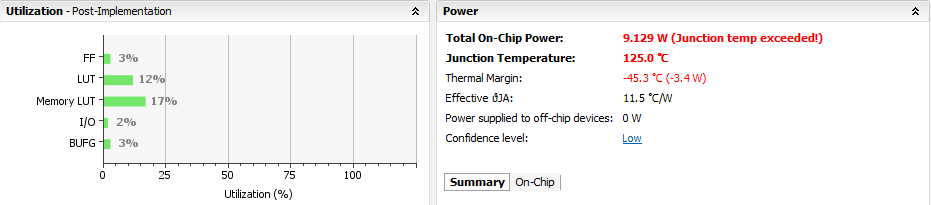
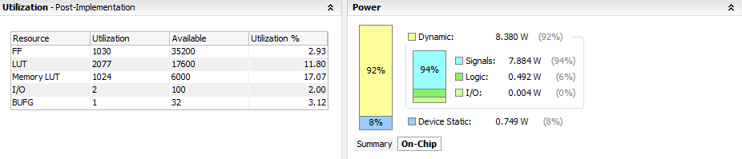

# Lab 3 Write Up

## Architecture
We created a single-cycle MIPS CPU that can implement the following instructions:

* LW
* SW
* J
* JR
* JAL
* BNE
* XORI
* ADD
* SUB
* SLT

## Block Diagram

## Test Plan
We had two main types of tests: unit tests and assembly tests.

### Unit Tests
Our CPU is made up of many different components, each of which is contained within its own verilog module. Theoretically, if each module is fully functional, the overall CPU should work as expected, assuming everything is wired together correctly. Therefore, we wrote tests for each individual module. In each of these unit tests, we tested every functionality of the module. Running a test will output if the module passes all of the tests, and, if not, what tests it failed.

### Assembly Tests
In order to test our overall CPU, we wrote an assembly program that uses every instruction that our CPU should be able to implement. To test whether or not the test was a success, we opened the waveform that the test generates and make sure that all of the registers in the register file are what they should be at the end of the test (our waveform allows us to look at individual registers). Furthermore, if we find that there is a problem with our CPU, looking at the waveforms is very useful for debugging: we can find the exact time and spot where something goes wrong just by looking at the waves.

## Design Analysis

To run analysis on our CPU, we synthesized and ran an implementation of our CPU running our multiply assembly test using Vivado.

The analysis shows that if we actually ran our CPU on an FPGA, we would have used more power than the FPGA could handle; our CPU requires 9.129 W. Most of this power (92%) is dynamic, with 7.884 W coming from signals.

Our area cost, however, is nowhere near enough to take up all of the FPGA's resources. Our components that take up the most space are our memory and LUTs. We also used a lot of flip flops, which is to be expected. The breakdown of our area costs are:

- Flip Flops: 1030, 2.93%
- LUT: 2077, 11.8%
- Memory LUT: 1024, 17.04%
- I/O: 2, 2% (including setting an LED in order to use Vivado, due to its requirement of having an output)
- Clock Buffer: 1, 3.12%

## Workplan Reflection:

We managed to follow the guidelines that we made for our work plan relatively well, up until the control part of the lab. Hence, we were relatively on track for finishing with a comfortable lead time up until Tuesday/Wednesday. Unfortunately, we had still underestimated the amount of time necessary for completing the controls. Furthermore, we had also had issues with finding an appropriate time for meetings, which had us sacrificing a day on our schedule. As a result, we had encountered more of a time crunch on Wednesday and Friday than what we had initially desired.
